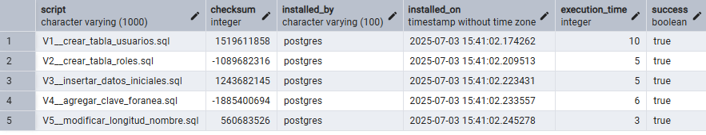
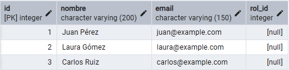
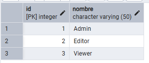

# 0.10. Temas Individuales por Integrante - Parte 2 (Informes)

# Gestión de Migraciones en Bases de Datos Relacionales( Henry Sarmiento)
Enfoque en Flyway

## 1. Introducción
En aplicaciones modernas, los cambios en la estructura de la base de datos relacional (como la creación o modificación de tablas) son tan frecuentes como los cambios en el código fuente. Sin embargo, muchas veces estos cambios no se versionan adecuadamente, generando inconsistencias entre entornos (desarrollo, pruebas, producción) o incluso pérdida de datos.

Para resolver este problema, se utilizan herramientas de gestión de migraciones de base de datos, las cuales permiten:

Versionar y documentar los cambios en el esquema de la base de datos.

Automatizar su aplicación de forma segura.

Sincronizar la evolución del esquema con el ciclo de vida del software.

Entre las herramientas más destacadas se encuentran Flyway, Liquibase y Ariga Atlas.

## 2. ¿Qué es una Migración de Base de Datos?
Una migración de base de datos es un conjunto de instrucciones o scripts que describen una modificación estructural a la base de datos. Estas migraciones se agrupan y aplican en orden, manteniendo un historial versionado que permite:

Auditar los cambios aplicados.

Restaurar estados anteriores (rollback).

Desplegar los mismos cambios en diferentes entornos de forma segura.

Las migraciones pueden incluir:

Creación o eliminación de tablas.

Adición o modificación de columnas.

Alteración de índices, claves foráneas o restricciones.

Carga de datos iniciales (data seed).

## 3. Descripción de Flyway

    

### 3.1 ¿Qué es Flyway?

Flyway es una herramienta de código abierto creada por Redgate que permite gestionar migraciones de bases de datos de forma simple, eficiente y automatizada. Es ampliamente utilizada por su facilidad de integración con pipelines de integración continua (CI/CD), así como por su compatibilidad con múltiples bases de datos y lenguajes.

### 3.2 Características clave
Compatible con más de 20 motores de bases de datos, incluyendo PostgreSQL, MySQL, Oracle, SQL Server, SQLite, entre otros.

- Utiliza archivos de migración versionados en SQL plano o Java.

- Registra todas las migraciones aplicadas en una tabla interna (flyway_schema_history).

- Soporta validación y control de integridad de las migraciones.

- Ofrece una versión CLI, embebida en Java, Gradle, Maven, Docker y más.

### 3.3 Arquitectura de Flyway

Como funciona?
Las migraciones se aplican en orden en función de susnúmero de versión: 

    

A medida que se aplica cada migración, la tabla de historial del esquema se actualiza en consecuencia:

    

Las migraciones se colocan en archivos numerados (ej: V1__crear_tabla.sql).

Flyway conecta a la base de datos por JDBC.

Aplica los cambios de forma transaccional.

Registra en una tabla interna el estado de cada migración.

### 3.4 Convención de nombres
Flyway usa una convención clara para nombrar los scripts de migración:

pgsql

V{número_de_versión}__{descripción}.sql
Ejemplo:

V1__crear_tabla_usuarios.sql

## 4. Comparativa con otras herramientas
Característica	Flyway	Liquibase	Ariga Atlas
| Característica                | Flyway                      | Liquibase                      | Ariga Atlas                    |
|------------------------------|-----------------------------|--------------------------------|--------------------------------|
| Lenguaje base                | SQL / Java                  | XML, YAML, JSON, SQL           | HCL / Go                       |
| Declarativo o imperativo     | Imperativo                  | Declarativo                    | Declarativo                    |
| Rollback automático          | No (solo manual)            | Sí                             | Sí                             |
| Fácil de usar                | Muy simple                  | Requiere configuración         | Requiere HCL / Go              |
| CI/CD friendly               | Muy integrado               | Sí                             | Sí                             |
| Historial de migraciones     | flyway_schema_history       | DATABASECHANGELOG              | atlas_schema_revisions         |
| Casos ideales                | Proyectos simples o medianos| Sistemas complejos con rollback| Infraestructura como código    |

## 5. Ejemplo práctico con Flyway

### 5.1 Requisitos

PostgreSQL instalado 

Flyway Community Edition descargado:
https://flywaydb.org/download/community

### 5.2 Estructura del proyecto

    

    

[demo code](https://github.com/AdrianSarmiento123/Demo2.git)

* flyway.url=jdbc:postgresql://127.0.0.1:5432/mi_basededatos
* flyway.user=postgres
* flyway.password=12345678
* flyway.locations=filesystem:./sql

### 5.3 Migraciones
V1__crear_tabla_usuarios.sql

*     CREATE TABLE usuarios (
*        id SERIAL PRIMARY KEY,
*        nombre VARCHAR(100) NOT NULL,
*        email VARCHAR(150) UNIQUE NOT NULL
*       );

V2__crear_tabla_roles.sql

*     CREATE TABLE roles (
*        id SERIAL PRIMARY KEY,
*        nombre VARCHAR(50) NOT NULL
*      );

V3__insertar_datos_iniciales.sql

*     INSERT INTO roles (nombre) VALUES ('Admin'), ('Editor'), ('Viewer');
*      
*     INSERT INTO usuarios (nombre, email)
*     VALUES 
*     ('Juan Pérez', 'juan@example.com'),
*     ('Laura Gómez', 'laura@example.com'),
*     ('Carlos Ruiz', 'carlos@example.com');

V4__agregar_clave_foranea.sql

*     ALTER TABLE usuarios ADD COLUMN rol_id INT;
*
*     ALTER TABLE usuarios
*     ADD CONSTRAINT fk_usuario_rol
*     FOREIGN KEY (rol_id)
*     REFERENCES roles(id);

V5__modificar_longitud_nombre.sql

*     ALTER TABLE usuarios
*     ALTER COLUMN nombre TYPE VARCHAR(200);

Ejecución del demo
Ejecutar el comando desde la carpeta raíz del proyecto:

*     flyway migrate

Verificar que las migraciones fueron aplicadas correctamente:

*     SELECT * FROM flyway_schema_history;
*     SELECT * FROM usuarios;
Resultado

    

    

    

como se puede observar los cambios se guardan por version como estaba en el nombre 
Esto nos permite tener un mejor control sobre los cambios en la base de datos

## 6. Conclusiones
Flyway es una herramienta sencilla pero potente para gestionar migraciones en bases relacionales.

Permite mantener la base de datos sincronizada con el código y aplicar cambios estructurales de forma segura.

Para proyectos más complejos que requieren rollback automático, herramientas como Liquibase o Atlas pueden ser más adecuadas.

## 7. Bibliografía y fuentes

Flyway Documentation – https://flywaydb.org/documentation

Liquibase Docs – https://docs.liquibase.com

Ariga Atlas – https://atlasgo.io

Redgate Blog – https://www.red-gate.com/blog

Fowler, M. (2010). Evolutionary Database Design. https://martinfowler.com/articles/evodb.html

---------------------------------------------------------------------------------------------------------------------------------------------

# Headless CMS (Enrrique Vertiz)

# 1. Introducción

Hoy en día, muchas empresas necesitan mostrar su contenido en diferentes plataformas, como páginas web, aplicaciones móviles o incluso pantallas digitales. Para lograrlo de forma rápida y eficiente, los sistemas tradicionales de gestión de contenido (CMS) ya no son suficientes. Por eso, han aparecido los **Headless CMS**, una nueva forma de manejar contenido que da mayor libertad a los desarrolladores.

Un Headless CMS separa la parte donde se crea y organiza el contenido de la parte visual que lo muestra al usuario. Así, se puede enviar ese contenido a cualquier plataforma a través de **APIs**, sin estar limitado a un diseño específico. Esto hace que el desarrollo sea más flexible, rápido y adaptable a diferentes necesidades.

Entre las opciones más conocidas están **Strapi**, que es de código abierto y funciona con **Node.js**, y **Contentful**, que es una plataforma basada en la nube. Ambas permiten crear, editar y mostrar contenido usando APIs, lo que ayuda a los equipos a trabajar de forma ordenada y eficiente.

Este trabajo presenta el diseño de una arquitectura para implementar un sistema usando Headless CMS, aplicando el marco **Attribute-Driven Design (ADD)**. Se describen los requerimientos del sistema, decisiones técnicas, tácticas de calidad, estructura del código y recomendaciones para su desarrollo.

# 2. Requerimientos del Sistema

## a. Requerimientos Funcionales

El sistema basado en Headless CMS tendrá como objetivo central permitir la gestión, estructuración y publicación de contenido a través de una API, facilitando su integración con distintos frontends (web o móvil). A continuación, se presentan los requerimientos funcionales clave:

- RF1: El usuario administrador podrá crear y gestionar tipos de contenido personalizados (artículos, productos, noticias).
- RF2: El sistema permitirá asignar roles y permisos a los usuarios (administrador, editor, solo lectura).
- RF3: Los usuarios con permisos podrán crear, editar, eliminar y publicar contenido desde una interfaz web.
- RF4: El contenido creado será accesible desde una API REST y/o GraphQL.
- RF5: El sistema debe permitir la carga de archivos multimedia (imágenes, documentos) y asociarlos a los contenidos.
- RF6: Debe existir un sistema de autenticación para proteger tanto el panel de administración como las APIs.
- RF7: El frontend podrá consultar contenido según categorías, etiquetas o campos personalizados.

### Casos de Uso

- **CU1: Crear nuevo tipo de contenido**  
  El administrador define los campos (texto, número, imagen, relación, etc.) que tendrá un nuevo tipo de contenido desde el panel de control.

- **CU2: Publicar contenido**  
  El editor llena los campos de un artículo y lo publica. Automáticamente se expone en la API.

- **CU3: Acceder a contenido desde el frontend**  
  Una aplicación web realiza una solicitud GET a la API para mostrar contenido dinámico en su interfaz.

## b. Escenarios a Nivel de Atributos de Calidad

| Atributo de Calidad | Escenario |
|---------------------|-----------|
| Disponibilidad      | El sistema debe seguir operando incluso si el frontend está inactivo o presenta fallas. |
| Rendimiento         | Las respuestas de la API deben generarse en menos de 500 ms para 90% de las peticiones. |
| Seguridad           | Solo usuarios autenticados con permisos específicos podrán acceder al panel de administración. |
| Escalabilidad       | El sistema debe poder escalar horizontalmente para atender múltiples solicitudes concurrentes. |
| Mantenibilidad      | La estructura modular del backend permitirá realizar cambios en modelos de contenido sin afectar la API. |

## c. Restricciones

- El proyecto debe usar **Strapi** o **Contentful** como solución Headless CMS.
- El sistema debe exponer contenido vía **REST API** o **GraphQL**.
- El backend debe estar implementado en **JavaScript (Node.js)**.
- Se utilizará **MongoDB** o base de datos relacional según lo soporte el CMS elegido.
- Si se usa Contentful, se deberá considerar su modelo SaaS y las restricciones del plan gratuito (límites de espacio, usuarios, API calls).

## d. Decisiones a Nivel de Arquitectura

| Categoría              | Decisión |
|------------------------|----------|
| Lenguaje de programación | JavaScript (Node.js) para Strapi o integración con APIs en caso de Contentful |
| Base de datos           | MongoDB (Strapi) o gestión interna (Contentful) |
| Patrón de arquitectura  | Cliente-servidor desacoplado usando APIs |
| Gestión de autenticación | JWT (Strapi) o API Keys/OAuth (Contentful) |
| Despliegue              | Posibilidad de usar plataformas como Heroku, Vercel, o Railway para despliegue del backend |

# 3. Tácticas

A continuación se detallan las tácticas aplicadas a cada atributo de calidad, basadas en los conceptos vistos en clase.

## Disponibilidad

**Detectar fallas**
- `Heartbeat`: Envío periódico de mensajes entre procesos para verificar actividad.
- `Monitor`: Revisión constante del estado del sistema.
- `Pruebas de sanidad`: Verificación automática del correcto funcionamiento interno.

**Recuperarse de fallas**
- `Redundancia activa/pasiva`: Uso de nodos de respaldo para mantener la continuidad del servicio.
- `Rollback`: Reversión del sistema a un estado anterior estable.
- `Degradación`: El sistema continúa operando con funciones mínimas si ocurre una falla parcial.

**Prevenir fallas**
- `Remover de servicio`: Retirar temporalmente componentes problemáticos.
- `Modelos predictivos`: Analizar condiciones para prevenir fallas antes de que ocurran.

## Mantenibilidad

**Reducir tamaño del módulo**
- `División de módulos`: Separar funcionalidades en unidades más pequeñas.

**Incrementar cohesión**
- `Reasignación de responsabilidades`: Separar funcionalidades no relacionadas en distintos módulos.

**Disminuir acoplamiento**
- `Encapsulamiento`: Definir interfaces claras para reducir dependencias.
- `Refactoring`: Extraer código común en módulos reutilizables.
- `Parametrización`: Uso de archivos de configuración para cambiar comportamiento sin alterar el código fuente.

## Interoperabilidad

**Localizar interfaces**
- `Descubrimiento de servicios`: Localización dinámica de APIs o servicios internos.

**Gestionar interfaces**
- `Orquestación`: Coordinación de múltiples servicios para flujos complejos.
- `Personalización de interfaces`: Adaptación de APIs según perfil del usuario.

## Rendimiento

**Controlar demanda de recursos**
- `Paginación y filtrado`: Evitar grandes volúmenes de datos innecesarios.
- `Limitar respuestas`: Máximo número de resultados por solicitud.
- `Reducir intermediarios`: Menor número de pasos entre entrada y salida.

**Gestionar recursos**
- `Uso de caché`: Guardar respuestas frecuentes o parciales.
- `Concurrencia`: Procesamiento paralelo para reducir tiempo de espera.

## Seguridad

**Detectar ataques**
- `Verificación de integridad`: Validar que los datos no han sido alterados.
- `Monitoreo de tráfico`: Detectar patrones maliciosos o sospechosos.

**Resistir ataques**
- `Autenticación y autorización`: Validación de usuarios y control de accesos.
- `Limitación de exposición`: Minimizar componentes accesibles públicamente.
- `Encriptación`: Proteger los datos tanto en tránsito como en reposo.

**Reaccionar y recuperarse**
- `Registro de eventos`: Logs de acciones y accesos para auditoría.
- `Alertas automáticas`: Notificaciones en tiempo real ante incidentes.
# 4. Propuesta de Arquitectura

La arquitectura propuesta se basa en el modelo C4 (Contexto, Contenedores, Componentes y Código). Esta arquitectura aprovecha los beneficios de un Headless CMS desacoplado para gestionar contenido y exponerlo vía API hacia cualquier frontend (web, móvil, etc.).

---

## Nivel 1: Diagrama de Contexto

El sistema se compone de los siguientes actores y relaciones:

- **Usuario administrador**: Accede al panel del CMS para crear y gestionar contenido.
- **Frontend web/app móvil**: Solicita contenido al CMS mediante API (REST o GraphQL).
- **Headless CMS (Strapi o Contentful)**: Gestiona el contenido y expone los datos mediante APIs.
- **Base de datos**: Almacena los modelos y contenido gestionado (solo aplica si se usa Strapi).

[Administrador] --> [Headless CMS]
[Frontend Web/App] --> [Headless CMS API]
[Headless CMS] --> [Base de Datos]

---

## Nivel 2: Diagrama de Contenedores

La solución se estructura en tres contenedores principales:

- **Frontend (React/Vue/etc.)**  
  Interfaz de usuario que consume el contenido expuesto por la API.

- **Headless CMS (Strapi o Contentful)**  
  Backend que permite la gestión del contenido.  
  - Si se usa **Strapi**: autohospedado con Node.js.  
  - Si se usa **Contentful**: SaaS en la nube.

- **Base de Datos (MongoDB o PostgreSQL)**  
  Utilizada por el CMS si se trabaja con Strapi.

---

## Nivel 3: Diagrama de Componentes (ejemplo con Strapi)

[CMS API Layer] <--> [Controladores] <--> [Servicios] <--> [Modelos de Datos]
|
[Base de Datos]

- **API Layer**: expone endpoints REST o GraphQL.
- **Controladores**: manejan las solicitudes del cliente.
- **Servicios**: lógica del negocio del CMS.
- **Modelos**: definición del contenido y sus validaciones.

---

## Nivel 4: Diagrama de Código (estructura base)
/cms-backend
│
├── api
│ ├── article
│ │ ├── controllers
│ │ ├── services
│ │ └── models
│ └── user
│ ├── controllers
│ ├── services
│ └── models
│
├── config
├── extensions
└── public

---

## Consideraciones de Despliegue

- **Strapi**:
  - Puede desplegarse en Railway, Render o Heroku.
  - Requiere configuración de base de datos, variables de entorno y rutas.

- **Contentful**:
  - No requiere despliegue (funciona en la nube).
  - El frontend se conecta mediante tokens y espacio API (Space ID).

---

## Tecnologías Sugeridas

| Capa        | Tecnología sugerida         |
|-------------|-----------------------------|
| Frontend    | React / Vue / Next.js       |
| CMS         | Strapi (Node.js) o Contentful |
| Base de Datos | MongoDB o PostgreSQL      |
| Hosting     | Railway / Vercel / Netlify  |

## 5. Estructura Inicial a Nivel de Código

El proyecto implementa un Headless CMS con **Strapi**, generando automáticamente una estructura modular. Se han realizado pequeñas personalizaciones en los archivos internos para definir un flujo básico que permite crear, leer y gestionar artículos.

A continuación se detalla la estructura real del repositorio:

cms-backend/
├── .strapi/
├── .tmp/
├── config/
│ └── database.js
├── dist/
├── node_modules/
├── public/
├── src/
│ └── api/
│ └── article/
│ ├── content-types/
│ │ └── article/
│ │ └── schema.json
│ ├── controllers/
│ │ └── article.js
│ └── services/
│ └── article.js
├── types/
├── .env
├── .env.example
├── .gitignore
├── .strapi-updater.json
├── favicon.png
├── license.txt
├── package.json
├── package-lock.json
├── README.md
├── tsconfig.json

markdown
Copiar
Editar

### Flujo básico implementado

Se creó un **Collection Type** llamado `Article` con los siguientes campos:
- `title` (Texto corto)
- `body` (Texto largo)
- `published_date` (Fecha y hora)

El flujo cubierto incluye:
- Registro de nuevos artículos desde el panel admin.
- Consulta de artículos mediante la API REST pública: `GET http://localhost:1337/api/articles`
- Edición y eliminación de artículos.

### Organización modular

Cada módulo (como `article`) está dividido en:
- `content-types/`: define el esquema del contenido (`schema.json`)
- `controllers/`: lógica para manejar las peticiones API
- `services/`: lógica de negocio asociada

Esto permite extender fácilmente el sistema agregando nuevos recursos, relaciones o lógica personalizada sin afectar otros módulos.

