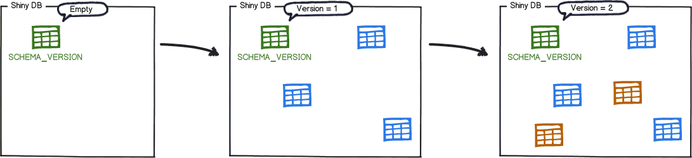
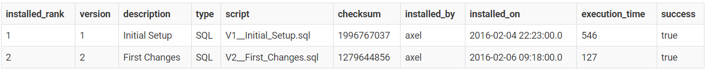
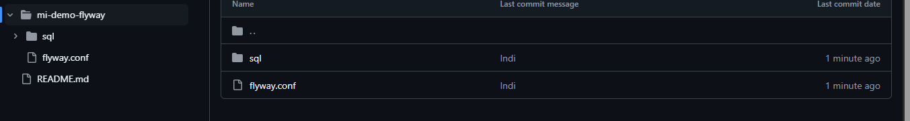
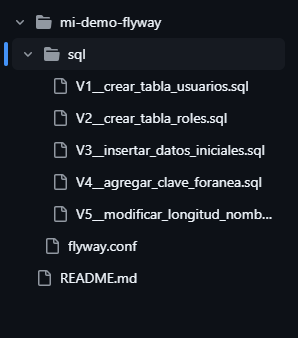

# 0.10. Temas Individuales por Integrante - Parte 2 (Informes)

# Gestión de Migraciones en Bases de Datos Relacionales( Henry Sarmiento)
Enfoque en Flyway

## 1. Introducción
En aplicaciones modernas, los cambios en la estructura de la base de datos relacional (como la creación o modificación de tablas) son tan frecuentes como los cambios en el código fuente. Sin embargo, muchas veces estos cambios no se versionan adecuadamente, generando inconsistencias entre entornos (desarrollo, pruebas, producción) o incluso pérdida de datos.

Para resolver este problema, se utilizan herramientas de gestión de migraciones de base de datos, las cuales permiten:

Versionar y documentar los cambios en el esquema de la base de datos.

Automatizar su aplicación de forma segura.

Sincronizar la evolución del esquema con el ciclo de vida del software.

Entre las herramientas más destacadas se encuentran Flyway, Liquibase y Ariga Atlas.

## 2. ¿Qué es una Migración de Base de Datos?
Una migración de base de datos es un conjunto de instrucciones o scripts que describen una modificación estructural a la base de datos. Estas migraciones se agrupan y aplican en orden, manteniendo un historial versionado que permite:

Auditar los cambios aplicados.

Restaurar estados anteriores (rollback).

Desplegar los mismos cambios en diferentes entornos de forma segura.

Las migraciones pueden incluir:

Creación o eliminación de tablas.

Adición o modificación de columnas.

Alteración de índices, claves foráneas o restricciones.

Carga de datos iniciales (data seed).

## 3. Descripción de Flyway

    

### 3.1 ¿Qué es Flyway?

Flyway es una herramienta de código abierto creada por Redgate que permite gestionar migraciones de bases de datos de forma simple, eficiente y automatizada. Es ampliamente utilizada por su facilidad de integración con pipelines de integración continua (CI/CD), así como por su compatibilidad con múltiples bases de datos y lenguajes.

### 3.2 Características clave
Compatible con más de 20 motores de bases de datos, incluyendo PostgreSQL, MySQL, Oracle, SQL Server, SQLite, entre otros.

- Utiliza archivos de migración versionados en SQL plano o Java.

- Registra todas las migraciones aplicadas en una tabla interna (flyway_schema_history).

- Soporta validación y control de integridad de las migraciones.

- Ofrece una versión CLI, embebida en Java, Gradle, Maven, Docker y más.

### 3.3 Arquitectura de Flyway

Como funciona?
Las migraciones se aplican en orden en función de susnúmero de versión: 

    

A medida que se aplica cada migración, la tabla de historial del esquema se actualiza en consecuencia:

    

Las migraciones se colocan en archivos numerados (ej: V1__crear_tabla.sql).

Flyway conecta a la base de datos por JDBC.

Aplica los cambios de forma transaccional.

Registra en una tabla interna el estado de cada migración.

### 3.4 Convención de nombres
Flyway usa una convención clara para nombrar los scripts de migración:

pgsql

V{número_de_versión}__{descripción}.sql
Ejemplo:

V1__crear_tabla_usuarios.sql

## 4. Comparativa con otras herramientas
Característica	Flyway	Liquibase	Ariga Atlas
| Característica                | Flyway                      | Liquibase                      | Ariga Atlas                    |
|------------------------------|-----------------------------|--------------------------------|--------------------------------|
| Lenguaje base                | SQL / Java                  | XML, YAML, JSON, SQL           | HCL / Go                       |
| Declarativo o imperativo     | Imperativo                  | Declarativo                    | Declarativo                    |
| Rollback automático          | No (solo manual)            | Sí                             | Sí                             |
| Fácil de usar                | Muy simple                  | Requiere configuración         | Requiere HCL / Go              |
| CI/CD friendly               | Muy integrado               | Sí                             | Sí                             |
| Historial de migraciones     | flyway_schema_history       | DATABASECHANGELOG              | atlas_schema_revisions         |
| Casos ideales                | Proyectos simples o medianos| Sistemas complejos con rollback| Infraestructura como código    |

## 5. Ejemplo práctico con Flyway

### 5.1 Requisitos

PostgreSQL instalado 

Flyway Community Edition descargado:
https://flywaydb.org/download/community

### 5.2 Estructura del proyecto

    

    

[demo code](https://github.com/AdrianSarmiento123/Demo2.git)

* flyway.url=jdbc:postgresql://127.0.0.1:5432/mi_basededatos
* flyway.user=postgres
* flyway.password=12345678
* flyway.locations=filesystem:./sql

### 5.3 Migraciones
V1__crear_tabla_usuarios.sql

*     CREATE TABLE usuarios (
*        id SERIAL PRIMARY KEY,
*        nombre VARCHAR(100) NOT NULL,
*        email VARCHAR(150) UNIQUE NOT NULL
*       );

V2__crear_tabla_roles.sql

*     CREATE TABLE roles (
*        id SERIAL PRIMARY KEY,
*        nombre VARCHAR(50) NOT NULL
*      );

V3__insertar_datos_iniciales.sql

*     INSERT INTO roles (nombre) VALUES ('Admin'), ('Editor'), ('Viewer');
*      
*     INSERT INTO usuarios (nombre, email)
*     VALUES 
*     ('Juan Pérez', 'juan@example.com'),
*     ('Laura Gómez', 'laura@example.com'),
*     ('Carlos Ruiz', 'carlos@example.com');

V4__agregar_clave_foranea.sql

*     ALTER TABLE usuarios ADD COLUMN rol_id INT;
*
*     ALTER TABLE usuarios
*     ADD CONSTRAINT fk_usuario_rol
*     FOREIGN KEY (rol_id)
*     REFERENCES roles(id);

V5__modificar_longitud_nombre.sql

*     ALTER TABLE usuarios
*     ALTER COLUMN nombre TYPE VARCHAR(200);

Ejecución del demo
Ejecutar el comando desde la carpeta raíz del proyecto:

*     flyway migrate

Verificar que las migraciones fueron aplicadas correctamente:

*     SELECT * FROM flyway_schema_history;
*     SELECT * FROM usuarios;

## 6. Conclusiones
Flyway es una herramienta sencilla pero potente para gestionar migraciones en bases relacionales.

Permite mantener la base de datos sincronizada con el código y aplicar cambios estructurales de forma segura.

Para proyectos más complejos que requieren rollback automático, herramientas como Liquibase o Atlas pueden ser más adecuadas.

## 7. Bibliografía y fuentes

Flyway Documentation – https://flywaydb.org/documentation

Liquibase Docs – https://docs.liquibase.com

Ariga Atlas – https://atlasgo.io

Redgate Blog – https://www.red-gate.com/blog

Fowler, M. (2010). Evolutionary Database Design. https://martinfowler.com/articles/evodb.html

