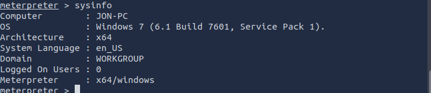

# 0.7. Integrante 6

## Informe: Hacking Ético: Wireshark y Metasploit Framework
### 1. Desarrollo conceptual

El Hacking Ético es la práctica de utilizar técnicas y herramientas de hacking con el propósito legal y autorizado de identificar vulnerabilidades y fallas de seguridad en sistemas, redes o aplicaciones informáticas. A diferencia del hacking malicioso o criminal, el hacking ético busca proteger y fortalecer la seguridad informática, ayudando a prevenir ataques reales y mejorar las defensas digitales.

El hacking ético incluye actividades como:

Pruebas de penetración (pentesting).

Análisis de vulnerabilidades.

Auditorías de seguridad.

Simulación de ataques para medir la respuesta del sistema.

Es una disciplina fundamental para mantener la integridad, confidencialidad y disponibilidad de la información, así como para cumplir con normativas y estándares de seguridad.

### 2. Consideraciones técnicas
Para entender y practicar hacking ético, es necesario conocer y manejar herramientas que faciliten la identificación de vulnerabilidades y el análisis del tráfico de red, entre otros aspectos. En este informe se describen dos herramientas clave:

Wireshark
Wireshark es un analizador y capturador de paquetes de red. Permite capturar en tiempo real el tráfico que circula por una red y analizar los datos contenidos en cada paquete, mostrando información detallada de protocolos, direcciones IP, puertos, y contenidos transmitidos.

Características técnicas principales:
Captura de tráfico en vivo o desde archivos guardados.

Soporte para cientos de protocolos de red.

Filtros para aislar el tráfico de interés.

Herramientas gráficas para estadística y visualización.

Análisis profundo de protocolos como TCP, UDP, HTTP, SMB, DNS, etc.

Wireshark es multiplataforma y puede instalarse en sistemas Windows, Linux y macOS. Para capturar tráfico requiere permisos administrativos.

Metasploit Framework
Metasploit es un framework para pruebas de penetración y explotación de vulnerabilidades. Incluye una gran cantidad de módulos para escaneo, explotación, post-explotación, y generación de payloads (cargas maliciosas).

Características técnicas principales:
Permite automatizar ataques a sistemas vulnerables.

Integra módulos para escaneo, recopilación de información y explotación.

Soporta múltiples tipos de payloads, como shells reversos o meterpreter.

Interfaz interactiva vía consola (msfconsole).

Se actualiza constantemente con nuevas vulnerabilidades y exploits.

Metasploit funciona principalmente en sistemas Linux, pero también tiene versiones para Windows y macOS. Su uso requiere conocimientos sobre redes, protocolos y seguridad.

### 3. Descripción de la demo
En la demostración práctica se combinarán ambas herramientas para mostrar un escenario realista de hacking ético:

Captura de tráfico con Wireshark: Se realizará una captura en tiempo real del tráfico generado en la red local, incluyendo tráfico normal (como pings o navegación web) y tráfico malicioso generado desde Metasploit.

Ejecutar un exploit con Metasploit: Se usará el exploit ms17_010 (EternalBlue) para atacar un sistema Windows vulnerable. Este exploit aprovecha una falla en el protocolo SMBv1 para obtener acceso remoto.

Análisis del tráfico generado: Wireshark mostrará los paquetes SMB relacionados con el ataque, evidenciando el patrón de comunicación entre atacante y víctima. Se aplicarán filtros para aislar el tráfico SMB y se analizará la interacción.

Interpretación de resultados: Se observará cómo un atacante puede comprometer un sistema y cómo el tráfico malicioso puede detectarse y analizarse con Wireshark, evidenciando la importancia de estas herramientas para la seguridad informática.

### Paso 1  Inicio de captura con Wireshark
Selecciona la interfaz de red correspondiente en mi cso ens5
Fitrar por ip para capturar los paquetes:
ip.addr == 10.10.165.233

    

    

### Paso 2  Iniciar Metasploit

    

Paso3 Configurar el exploit EternalBlue

    

### Paso 3 Post-explotación básica 

    

    

    

    

    

### Paso Final Observar captura y guardar evidencia

    

### Conclusión

El presente ejercicio demostró cómo las herramientas de hacking ético pueden ser utilizadas para identificar y explotar vulnerabilidades en entornos controlados con el objetivo de fortalecer la seguridad informática. A través del uso del Metasploit Framework, se logró explotar la vulnerabilidad crítica MS17-010 (EternalBlue) presente en sistemas Windows 7, permitiendo obtener acceso remoto mediante una sesión meterpreter. Simultáneamente, con Wireshark, fue posible capturar y analizar el tráfico de red generado por el ataque, identificando patrones y paquetes asociados a la explotación del protocolo SMB.

Esta demostración permite comprender la importancia de mantener los sistemas actualizados, monitorear el tráfico de red y realizar auditorías regulares. En el ámbito del hacking ético, estas prácticas no solo evidencian fallas de seguridad, sino que también brindan oportunidades para diseñar defensas más robustas ante amenazas reales.

Referencias 

https://tryhackme.com/room/metasploitintro
https://www.wireshark.org/download.html
https://www.offsec.com/metasploit-unleashed/
https://www.metasploit.com/