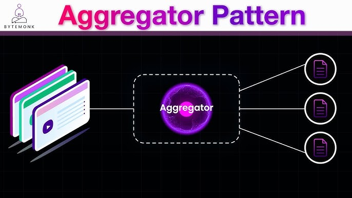
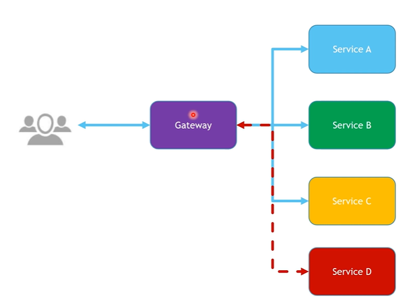
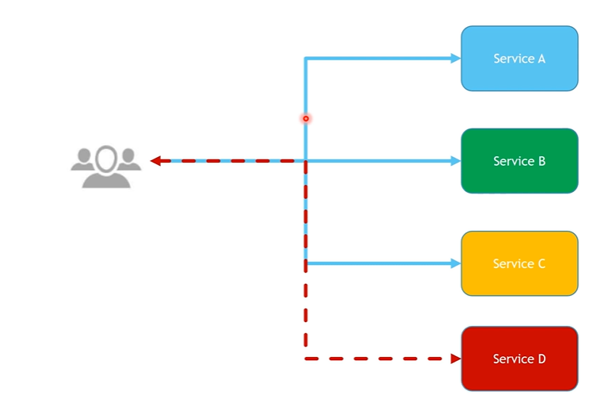
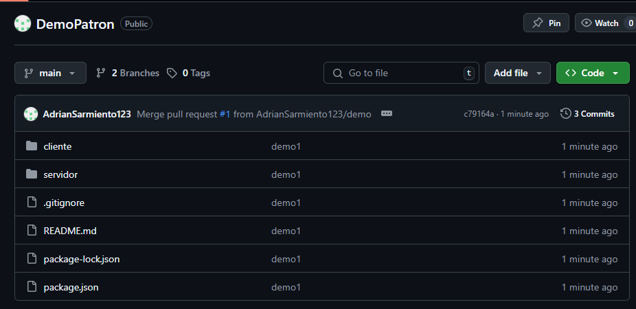

# 0.9. Trabajo Individual - Patrones Cloud (Informes y Videos)

## Patrón: Gateway Aggregation Pattern - Henry Sarmiento

    

### 1. Problema

En arquitecturas de microservicios, una sola acción de un cliente (como cargar una página web) puede requerir datos de múltiples servicios. Si el cliente realiza múltiples llamadas directamente, se expone a:

- Lógica de integración innecesaria del lado del cliente.

- Alta latencia debido a múltiples viajes de ida y vuelta.

- Problemas de compatibilidad y acoplamiento con cambios internos de los microservicios.

    

Fuente de [Microsoft](https://learn.microsoft.com/en-us/azure/architecture/patterns/gateway-aggregation)

    

Fuente de [Hussein Awad, 2021](https://www.youtube.com/watch?v=8NCo1lwiqwc)

Problema principal: Cómo centralizar y simplificar el acceso a múltiples servicios para mejorar rendimiento, escalabilidad y reducir la complejidad del cliente.

### 2. Solución
El Gateway Aggregation Pattern propone la creación de un componente intermedio (gateway) que:

- Recibe una solicitud del cliente.

- Invoca múltiples servicios en segundo plano.

- Agrega las respuestas.

Devuelve una única respuesta consolidada.

    

Fuente de [Microsoft](https://learn.microsoft.com/en-us/azure/architecture/patterns/gateway-aggregation)

    

Fuente de [Hussein Awad, 2021](https://www.youtube.com/watch?v=8NCo1lwiqwc)

Ventajas:

- Reduce la cantidad de solicitudes desde el cliente.

- Abstrae y oculta la complejidad del backend.

- Mejora la experiencia de usuario al disminuir la latencia percibida.

Ejemplos reales:

En Netflix, Zuul y Spring Cloud Gateway son ejemplos comunes.

GraphQL puede verse como una evolución del patrón, al permitir al cliente especificar qué campos desea agregar desde múltiples fuentes.

Azure API Management permite implementar gateways agregadores con políticas.

### 3. Casos de Aplicación
Industria / Empresa / Sector:

*E-commerce:* Para mostrar una página de producto se requieren datos del inventario, precios, reseñas y productos relacionados.

*Startups de salud:* Consolidar información de distintos microservicios como historial clínico, medicamentos, y citas médicas.

*Aplicaciones bancarias:* Dashboard financiero que reúne saldos, transacciones y alertas de distintos sistemas internos.

*SaaS / ERP:* Paneles administrativos que requieren datos de múltiples servicios (usuarios, permisos, métricas, logs).

### 4. Aplicación en el Trabajo de Grupo (SportSync)
En el contexto del sistema SportSync (para reservas deportivas):

Aplicación del patrón:

- Crear un Gateway de "Dashboard del Usuario", que consolide:

- Reservas activas.

- Historial de pagos.

- Notificaciones recientes.

- Información de perfil y membresía.

    

[demo code](https://github.com/AdrianSarmiento123/DemoPatron.git)

    

Beneficios:

- Mejor experiencia del usuario al recibir toda su información en una sola solicitud.

- Reducción de lógica en el frontend.

- Mejora de rendimiento y monitoreo centralizado del acceso a microservicios.

Consideraciones:

- Gestión de errores en cascada si un microservicio falla.

- Control de tiempos de espera (timeout) y reintentos.

- Uso de caché o circuit breaker para mejorar la resiliencia.