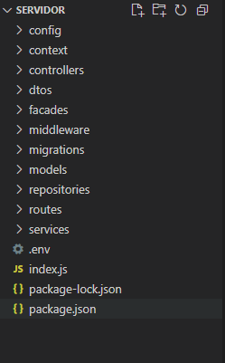
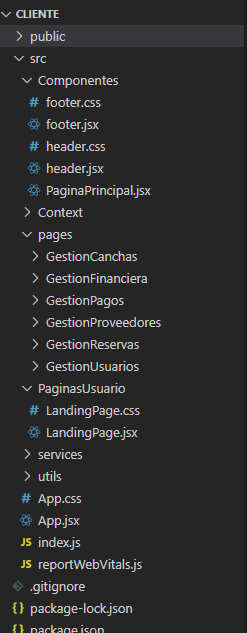

# 7.2. Mapeo Aplicaciones vs Módulos

| Aplicación                | Gestión de Reservas | Gestión de Pagos | Gestión de Proveedores y Mantenimiento | Gestión Financiera | Gestión de Usuarios y Entidades | Notificaciones |
|---------------------------|---------------------|------------------|----------------------------------------|---------------------|-------------------------------|----------------|
| Aplicación Web (Cliente)  | ✔                   | ✔                |                                        |                     | ✔                             | ✔              |
| API Principal (Node/Express) | ✔               | ✔                | ✔                                      | ✔                   | ✔                             | ✔              |

## Frontend React

    

Carpeta raíz: CLIENTE

node_modules: Contiene todas las dependencias instaladas mediante NPM.

public: Carpeta con archivos estáticos, como el index.html.

src: Carpeta principal del código fuente de la aplicación.

Dentro de src:

Componentes: Contiene componentes reutilizables como:

header.jsx, footer.jsx: Componentes del encabezado y pie de página.

header.css, footer.css: Estilos asociados a los componentes anteriores.

PaginaPrincipal.jsx: Página principal general del sistema.

Context: Manejo del contexto global (React Context API) para estado compartido.

pages: Se organiza en subcarpetas por módulo funcional:

GestionCanchas

GestionFinanciera

GestionPagos

GestionProveedores

GestionReservas

GestionUsuarios

PaginasUsuario:

LandingPage.jsx y su hoja de estilo LandingPage.css: Página de bienvenida o acceso para el usuario.

services: Servicios para conectar con la API backend.

utils: Funciones o herramientas auxiliares reutilizables.

App.css: Estilos globales de la aplicación.

App.jsx: Componente raíz del frontend.

index.js: Punto de entrada de React.

reportWebVitals.js: Para medir el rendimiento de la aplicación.

## Backend Node.js

    

Carpeta raíz: SERVIDOR

node_modules: Contiene las dependencias de Node.js instaladas con NPM.

.env: Variables de entorno (puertos, claves, cadenas de conexión, etc.).

index.js: Archivo principal del servidor (punto de arranque).

package.json y package-lock.json: Información del proyecto y sus dependencias.

Carpetas internas:

config: Configuraciones del servidor o base de datos.

context: Posiblemente usado para manejo del contexto o inicialización de recursos.

controllers: Controladores que gestionan la lógica de las rutas.

dtos: Objetos de transferencia de datos, utilizados para validar y transportar datos entre capas.

facades: Fachadas para abstraer lógica compleja en interfaces más simples.

middleware: Funciones intermedias (como autenticación, validación, etc.).

migrations: Archivos de migración para crear/modificar tablas en la base de datos.

models: Modelos de datos (probablemente usando un ORM como Sequelize).

repositories: Acceso y consulta a la base de datos.

routes: Definiciones de rutas de la API.

services: Lógica de negocio o servicios específicos del dominio.