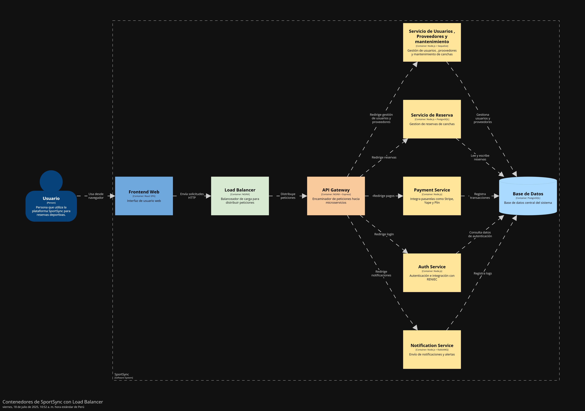
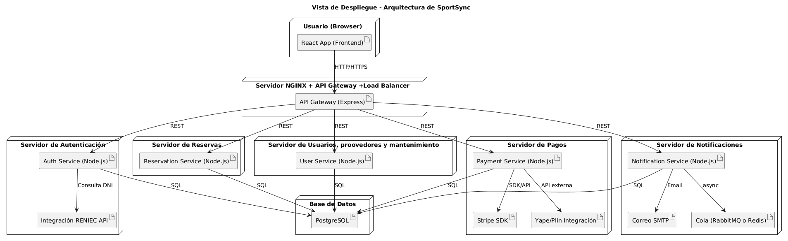

# 9.2 Iteración 1: Definir la estructura general del sistema

## 1. Objetivo de la Iteración

Objetivo de la Iteración:
Implementar la estructura funcional principal para cubrir los módulos base del sistema, priorizando escenarios de uso clave como la reserva de canchas, registro de usuarios, gestión de pagos, y la administración de proveedores. Esto permitirá una validación temprana de la experiencia del usuario y del desempeño del sistema.

Drivers relevantes:

-  QA-1: Rendimiento (respuestas rápidas en búsqueda y reservas)

-  QA-2: Modificabilidad (facilidad para extender filtros o medios de pago)

-  QA-3: Disponibilidad (resiliencia al fallo en reservas o pagos)

-  QA-4: Usabilidad (interacción fluida en la vista calendario y filtros)

-  CRN-1: Iniciar desde cero implica diseñar módulos desacoplados y bien definidos.

-  CON-2: Acceso desde navegadores multiplataforma.

-  CON-3: Uso de base de datos relacional (ej. PostgreSQL).

-  CON-4: Consideración de conexiones con bajo ancho de banda.

---

## 2. Elementos del Sistema a Refinar

** Diagrama de Contexto **

&nbsp;   

## 3. Conceptos de Diseño para Satisfacer los Drivers

| Código    | Decisión de Diseño                                                                                | Fundamentación                                                                                                                                                                                                                                                                                              |
|-----------|---------------------------------------------------------------------------------------------------|--------------------------------------------------------------------------------------------------------------------------------------------------------------------------------------------------------------------------------------------------------------------------------------------------------------|
| **DEC-1** | La estructura lógica del cliente usará una arquitectura Web SPA basada en React.                  | Una SPA (Single Page Application) permite una experiencia fluida y altamente interactiva, esencial para usuarios que reservan canchas y gestionan pagos en tiempo real. React ofrece componentes reutilizables y eficiencia en el renderizado. Se descartan apps móviles o desktop por complejidad y costo. |
| **DEC-2** | La estructura lógica del servidor usará el patrón Service Application con Express.                | Express.js sobre Node.js permite alta concurrencia y desarrollo rápido de APIs REST. La lógica del backend se organiza en capas (controladores, servicios, repositorios) lo que mejora la mantenibilidad y prueba de unidades. Ideal para una arquitectura modular y escalable.                             |
| **DEC-3** | Se utilizará una arquitectura REST para integrar servicios externos como RENIEC y Stripe.         | Las integraciones con APIs públicas (validación de identidad con RENIEC, pagos con Stripe o Yape/Plin) requieren protocolos simples y ampliamente soportados. REST permite flexibilidad, trazabilidad de errores y compatibilidad con herramientas de monitoreo y pruebas automáticas.                      |
| **DEC-4** | Se aplicará una arquitectura de colas de mensajes para correos y notificaciones.                  | El uso de colas (RabbitMQ o Redis Streams) mejora la disponibilidad al desacoplar procesos críticos como reservas y pagos de tareas secundarias como envío de correos. Esto asegura que una falla en notificaciones no interrumpa el flujo principal del sistema.                                           |
| **DEC-5** | Se optará por modularidad basada en dominios funcionales en el backend.                           | Organizar el código por dominios como usuarios, reservas, pagos, notificaciones facilita la mantenibilidad, pruebas y asignación de equipos. Esta decisión mejora la claridad del diseño y permite escalar partes específicas sin afectar otras.                                                            |
| **DEC-6** | Se empleará infraestructura basada en contenedores con Docker y soporte a NGINX como API Gateway. | Docker permitirá desplegar la plataforma de forma portátil y replicable en distintos entornos. NGINX actuará como API Gateway centralizado, balanceando carga y gestionando seguridad. Se considera fundamental para garantizar rendimiento y disponibilidad bajo demanda concurrente.                      |

---

## 4. Elementos de Arquitectura y Responsabilidades

| Código     | Decisión de Diseño                                                                                        | Fundamentación                                                                                                                                                                                                                                                                             |
|------------|------------------------------------------------------------------------------------------------------------|----------------------------------------------------------------------------------------------------------------------------------------------------------------------------------------------------------------------------------------------------------------------------------------------|
| **DEC-7**  | Se eliminarán orígenes de datos locales en el cliente; todo se consultará al servidor.                    | La aplicación estará siempre conectada a internet (web-based), lo que elimina la necesidad de almacenamiento local. Esto garantiza que la información de reservas, pagos y validación de identidad esté siempre sincronizada y actualizada con el backend.                                 |
| **DEC-8**  | Crear un módulo `AuthService` responsable de autenticación y validación de identidad con RENIEC.          | Centraliza la autenticación del usuario y la validación externa con RENIEC vía API REST. El `AuthService` abstrae estas responsabilidades del resto del sistema, favoreciendo el cumplimiento del driver de seguridad (QA-2) y apoyo al caso de uso de registro y login (UC-1, UC-2).      |
| **DEC-9**  | Definir un `PaymentGatewayModule` para gestionar integración con Stripe, Yape, Plin u otros.              | Este módulo encapsula las interacciones con las pasarelas de pago externas. Define interfaces como `createPaymentSession`, `confirmPayment`, etc. Esto permite desacoplar el core del sistema de la lógica específica de cada proveedor, facilitando cambios futuros.                      |
| **DEC-10**  | Instanciar un `NotificationService` asíncrono para correos y alertas.                                     | Este componente será responsable de gestionar notificaciones (email, SMS, push) de forma desacoplada mediante colas de mensajes. Define interfaces como `sendReservationAlert(user, cancha)` o `notifyPaymentSuccess(user, monto)`. Mejora la disponibilidad (QA-3) y reduce acoplamiento. |
| **DEC-11** | Incorporar un módulo `ReservationManager` con interfaz RESTful.                                           | Este servicio coordina la lógica de reserva de canchas, revisa disponibilidad, crea reservas, y actualiza estados. Define endpoints como `POST /reservas`, `GET /reservas/:id`, que serán consumidos por la SPA. Ayuda a lograr UC-3 (reservar cancha) y UC-4 (ver disponibilidad).        |
| **DEC-12** | Implementar un `UserProfileModule` con acceso a base de datos y verificación.                             | Encargado de crear, editar y consultar datos de usuarios (freelancer, cliente, administrador). Este módulo se comunica con la base de datos a través del repositorio `UserRepository`, y expone una interfaz REST para el frontend (`GET /usuarios/:id`, `PUT /usuarios/:id`).             |
| **DEC-13** | API Gateway (NGINX) definirá el punto de entrada y el enrutamiento a microservicios o servicios internos. | Este componente recibirá todas las solicitudes HTTP y las distribuirá a los servicios correspondientes (auth, pagos, reservas, usuarios, etc.). Permite aplicar reglas de seguridad, balanceo de carga y logging centralizado.   

## 5. Vistas y Patrones Aplicados

&nbsp;   

&nbsp;   

## 6. Analizar el diseño actual, revisar objetivo de la iteración y logro del propósito del diseño

| **Consideración**                                                                    | **Estado de Abordaje**     | **Decisión de Diseño (Iteración Actual)**                                                                |
|--------------------------------------------------------------------------------------|----------------------------|----------------------------------------------------------------------------------------------------------|
| **CON-1**: Iniciar desde cero implica diseñar módulos desacoplados y bien definidos. | **Parcialmente Abordado**  | DEC-3 (Integración REST desacoplada), DEC-5 (Modularidad por dominio)                                    |
| **CON-2**: Acceso desde navegadores multiplataforma.                                 | **Completamente Abordado** | DEC-1 (SPA con React para compatibilidad web multiplataforma)                                            |
| **CON-3**: Uso de base de datos relacional (PostgreSQL).                             | **Completamente Abordado** | DEC-3 (Integración con sistemas externos y backend REST conectado a base de datos relacional)            |
| **CON-4**: Conexiones con bajo ancho de banda.                                       | **Parcialmente Abordado**  | DEC-1 (SPA que reduce recargas), DEC-5 (Backend optimizado modularmente, pero aún sin manejo offline)    |
| **CON-5**: Integración con pasarelas de pago nacionales (Yape, Plin).                | **Parcialmente Abordado**  | DEC-9 (PaymentGatewayModule prevé integración futura, se mencionan Yape/Plin pero no se implementan aún) |
| **CON-6**: Validación de identidad con RENIEC.                                       | **Parcialmente Abordado**  | DEC-3 (REST para APIs externas), DEC-8 (AuthService previsto, falta detalle técnico de la API de RENIEC) |
