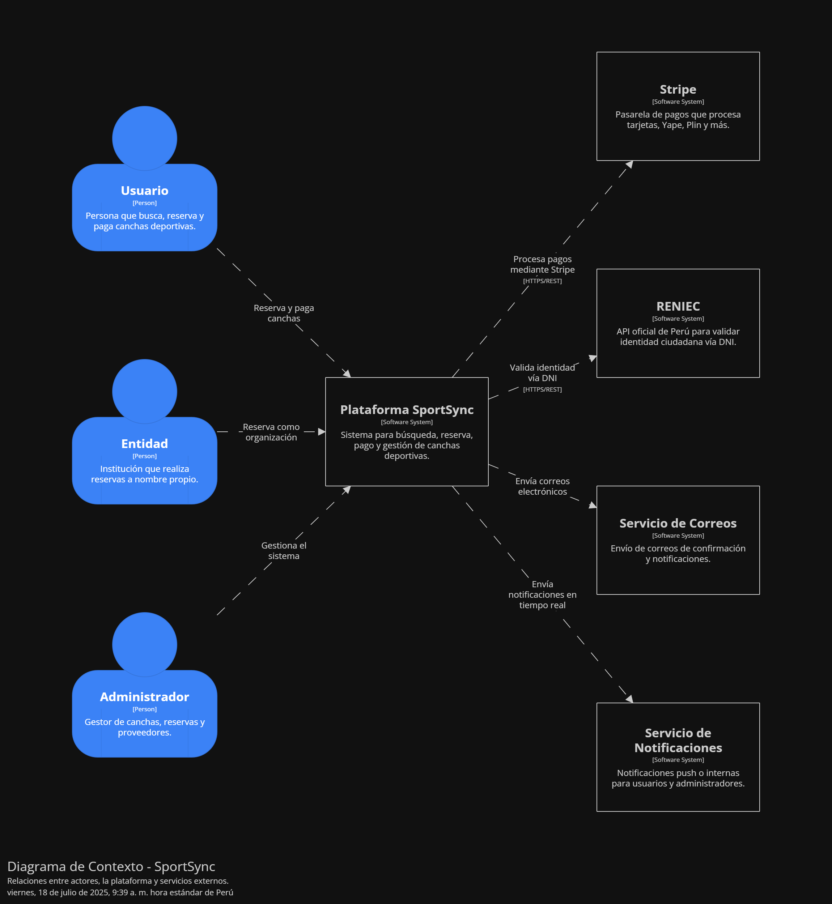

\# 9.2 Iteración 1: Definir la estructura general del sistema

\## 1. Objetivo de la Iteración

Definir la estructura inicial de la plataforma \*\*SportSync\*\*, estableciendo la arquitectura real utilizada: \*\*frontend React modular\*\*, \*\*backend Express en capas\*\*, \*\*PostgreSQL\*\* como base de datos única, \*\*API Gateway Centralizado con NGINX\*\* y la integración de \*\*Stripe\*\* para pagos.

---

\## 2. Elementos del Sistema a Refinar

\*\*Diagrama de Contexto\*\*

&nbsp;   

\## 3. Conceptos de Diseño para Satisfacer los Drivers

| Código | Decisión de Diseño | Fundamentación |

|--------|--------------------|----------------|

| DEC-1 | Arquitectura modular en frontend y backend por capas | React se estructura por módulos/domino funcional y Express organiza sus responsabilidades en capas (rutas, controladores, servicios, modelos). Facilita mantenibilidad y escalabilidad. |

| DEC-2 | API Gateway Centralizado (NGINX) | NGINX actúa como reverse proxy, centralizando todas las llamadas REST y gestionando headers, CORS y redirecciones hacia los módulos Express. |

| DEC-3 | PostgreSQL como base de datos única | PostgreSQL gestiona todas las entidades relacionales del sistema: usuarios, reservas, pagos y reportes. Se optimiza mediante claves foráneas e índices. |

| DEC-4 | Comunicación RESTful síncrona | Toda la comunicación entre módulos es vía APIs REST síncronas, expuestas de forma unificada a través de NGINX. |

| DEC-5 | Stripe para procesamiento de pagos | Stripe procesa los pagos premium y servicios de reserva, cumpliendo con estándares de seguridad PCI-DSS y webhooks validados. |

---

\## 4. Elementos de Arquitectura y Responsabilidades

| Módulo | Descripción | Tecnología | Patrón |

|--------|--------------|------------|--------|

| Frontend React | Estructura modular organizada por dominio: usuarios, reservas, pagos y dashboard financiero | React.js con Hooks, Context API y React Router | Modular por páginas y componentes |

| Backend Express | Organizado en capas: rutas, controladores, servicios, modelos (Sequelize) | Node.js, Express, Sequelize | Patrón en capas |

| API Gateway | NGINX configurado como reverse proxy y concentrador de tráfico | NGINX | Gateway RESTful |

| Base de Datos | Base de datos única con esquema relacional normalizado | PostgreSQL | Modelo relacional |

| Pasarela de Pagos | Integración para pagos premium | Stripe API | Webhooks REST |

\## 5. Vistas y Patrones Aplicados

\### Clave

| Atributo | Táctica Aplicada |

|----------------|----------------|

| Disponibilidad | Réplicas backend detrás de NGINX |

| Rendimiento | Indexación SQL, pool Sequelize, agregación de datos en Gateway |

| Seguridad | Middleware JWT para rutas protegidas |

| Mantenibilidad | Modularidad y separación por capas |

| Interoperabilidad | Orquestación y agregación de datos con Gateway Aggregation Pattern |

| Pagos | Stripe con webhooks validados |

\## 6. Analizar el diseño actual, revisar objetivo de la iteración y logro del propósito del diseño

| Elemento     | Estado                | Decisión de diseño aplicada |

|--------------|-----------------------|------------------------------|

| ESC-06       | Completamente Abordado |  |

| ESC-07       | Completamente Abordado |  |

| ESC-INT-01   | Completamente Abordado |  |

| ESC-INT-03   | Completamente Abordado |  |

| ESC-SEC-04   | Completamente Abordado |  |

| ESC-PRB-01   | Parcialmente Abordado  |  |

| ESC-USA-04   | Completamente Abordado |  |

| ESC-SEC-05   | Completamente Abordado |  |

\### \*\*Resumen de la Iteración 1\*\*

Esta primera iteración ha establecido exitosamente:

1\. \*\*Arquitectura modular y en capas\*\* aplicando separación de responsabilidades por dominio funcional (frontend React modular, backend Express estructurado en capas).

2\. \*\*Stack tecnológico completo\*\* alineado con las restricciones y decisiones reales: React, Node.js + Express, PostgreSQL y Stripe.

3\. \*\*Comunicación RESTful síncrona\*\* entre todos los módulos backend mediante un \*\*API Gateway centralizado con NGINX\*\*.

4\. \*\*Patrón Gateway Aggregation Pattern\*\* para orquestar y consolidar respuestas de múltiples capas backend antes de exponerlas al cliente.

5\. \*\*Modelo de datos relacional único\*\* optimizado para integridad y rendimiento (PostgreSQL).

6\. \*\*Integración de pagos premium con Stripe\*\*, cumpliendo con seguridad PCI-DSS mediante webhooks.

Todos los casos de uso principales, escenarios de calidad priorizados (disponibilidad, mantenibilidad, interoperabilidad, seguridad) y restricciones clave han sido \*\*abordados parcialmente o completamente\*\* en esta iteración inicial, estableciendo una base sólida para el refinamiento posterior.

---

\### \*\*Infraestructura esperada\*\*

\- Backend Express organizado por capas (rutas, controladores, servicios, modelos con Sequelize).

\- Frontend React estructurado por módulos (usuarios, reservas, pagos, reportes).

\- Base de datos única PostgreSQL con modelo relacional normalizado.

\- API Gateway centralizado con NGINX actuando como reverse proxy.

\- Patrón \*\*Gateway Aggregation\*\* configurado en el Gateway para orquestar llamadas a múltiples endpoints backend.

\- Stripe como procesador de pagos premium vía webhooks seguros.

\- Servidores Node.js detrás del Gateway, configurados para escalabilidad horizontal básica (ej. PM2 o cluster).

---

\### \*\*Funcionalidades esperadas\*\*

\*\*Gestión de Usuarios:\*\*

\- Registro y autenticación local con JWT y middleware de seguridad.

\- Edición y visualización de perfil de usuario.

\*\*Reservas:\*\*

\- Creación de reservas mediante formularios React conectados a rutas Express protegidas.

\- Listado de reservas activas y filtrado básico.

\*\*Pagos Premium:\*\*

\- Integración con Stripe para activar planes premium y registrar transacciones.

\- Webhooks validados para registrar pagos y actualizar estados en la base de datos.

\*\*Dashboard Financiero:\*\*

\- Visualización de reportes básicos de reservas y pagos.

\- Datos agregados servidos mediante el \*\*Gateway Aggregation Pattern\*\*.

---

Este resumen refleja la \*\*base técnica y funcional real\*\* de tu plataforma, sobre la cual se realizarán iteraciones futuras para mejorar disponibilidad, rendimiento y nuevas integraciones.

