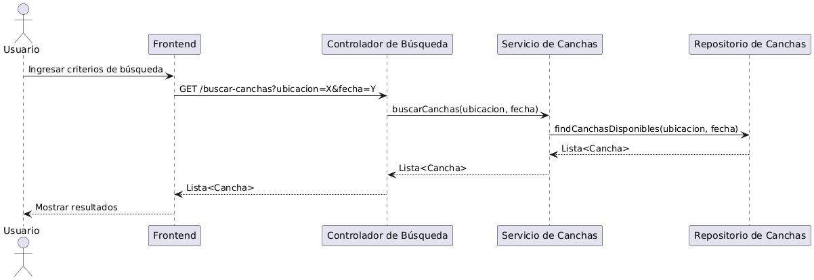
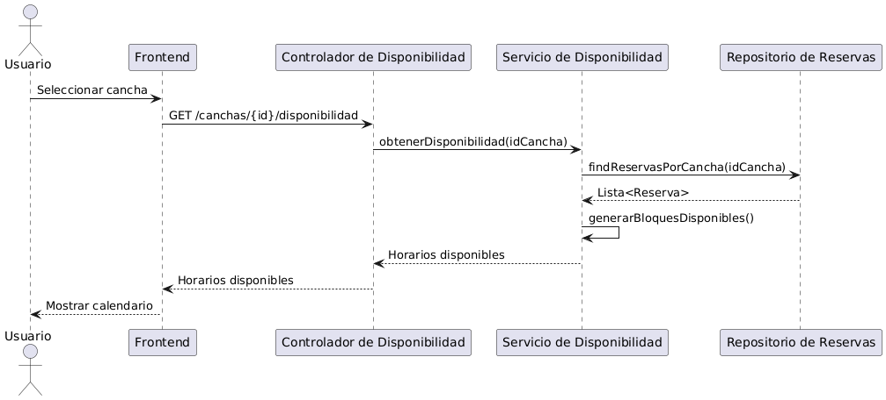
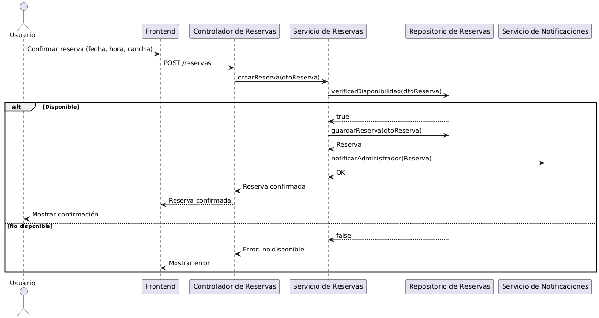

\# 9.3 Iteración 2: Identificar estructuras para soportar la funcionalidad primaria

---

## 1. Revisar Entradas

| **Propósito de Diseño**                                         | **Funcionalidad Primaria**                                                                     | **Escenarios de Calidad**                                                                                              | **Restricciones y Preocupaciones de Arquitectura**                                                                                                   |
|-----------------------------------------------------------------|-----------------------------------------------------------------------------------------------|-----------------------------------------------------------------------------------------------------------------------|-----------------------------------------------------------------------------------------------------------------------------------------------------|
| Identificar estructuras para soportar la funcionalidad primaria | UC-1 (Buscar cancha), UC-2 (Visualizar disponibilidad en calendario), UC-7 (Confirmar reserva) | DISP-01 (respuesta rápida ante búsqueda), MOD-03 (cambio de lógica de disponibilidad), USAB-01 (fluidez de navegación) | CON01 (infraestructura limitada), CON03 (interfaz simple), CRN01 (soporte a crecimiento), CRN04 (interoperabilidad), CRN07 (soporte multiplataforma) |

## 2. Establecer objetivo de la iteración

El objetivo de esta iteración es definir e implementar las estructuras necesarias para que el flujo principal de reservas en SportSync funcione de extremo a extremo: desde la búsqueda de canchas disponibles hasta la confirmación de la reserva por parte del usuario. Se busca garantizar una experiencia fluida, rápida y confiable, considerando la disponibilidad, la usabilidad en dispositivos móviles y la consistencia de la información mostrada en tiempo real.

---

\## 3. Elegir uno o más elementos del sistema a refinar

En esta iteración se refinarán los siguientes módulos:

Gestión de Búsqueda de Canchas

Visualización de Disponibilidad (Calendario)

Proceso de Confirmación de Reserva

Gestión de Notificaciones al Administrador

Esto permite habilitar completamente el flujo base de reserva para usuarios, validando la interacción entre componentes clave, la gestión de disponibilidad en tiempo real y las restricciones establecidas en cuanto a escalabilidad, rendimiento y experiencia del usuario.

---

## 4. Conceptos de Diseño para Satisfacer el Driver

| Código | Decisión de Diseño                                                                                     | Fundamentación                                                                                                                                                                  |
|--------|------------------------------------------------------------------------------------------------------|--------------------------------------------------------------------------------------------------------------------------------------------------------------------------------|
| DEC-14  | Crear un modelo de dominio para las entidades clave del sistema                                        | Es necesario definir entidades como Cancha, Reserva, Usuario, Proveedor y Servicio para estructurar la lógica del negocio.                                                     |
| DEC-15  | Identificar objetos de dominio vinculados a los casos de uso CU10, CU15, CU16, CU17, CU23, CU25        | Permite trazar la relación directa entre las funcionalidades principales y los objetos que las implementan.                                                                    |
| DEC-16  | Descomponer los objetos de dominio en componentes distribuidos por capas (presentación, lógica, datos) | Se busca claridad, mantenibilidad y separación de responsabilidades. Además, facilita escalar partes del sistema por separado.                                                 |
| DEC-17  | Uso de Express.js y Sequelize ORM en el backend                                                        | Express es un framework liviano, ampliamente adoptado, y Sequelize permite un mapeo ágil a la base de datos PostgreSQL. El equipo ya está familiarizado con estas herramientas. |
| DEC-18  | Implementar DTOs para controlar los datos expuestos entre capas                                        | Mejora la seguridad y permite control estricto de lo que se expone o recibe en los endpoints.                                                                                  |

---

## 5. Elementos de Arquitectura, Responsabilidades e Interfaces

| Código | Decisión de Diseño                                                                                     | Fundamentación                                                                                                            |
|--------|------------------------------------------------------------------------------------------------------|--------------------------------------------------------------------------------------------------------------------------|
| DEC-19  | Crear el modelo inicial de dominio con Cancha, Reserva, Usuario, Proveedor, Servicio                   | Base necesaria para codificar los flujos funcionales y validar reglas de negocio.                                         |
| DEC-20 | Mapear los casos de uso seleccionados (CU10, CU15, CU16, CU17, CU23, CU25) a objetos de dominio        | Se garantiza coherencia entre requerimientos funcionales y el diseño arquitectónico.                                      |
| DEC-21 | Dividir los objetos en módulos organizados por capas: controladores, servicios, repositorios y modelos | Permite mayor claridad en la organización del código y facilita testing y mantenimiento.                                  |
| DEC-22 | Conectar componentes con Express.js en la capa de control y Sequelize en la capa de datos              | Frameworks livianos, eficaces y adecuados para una arquitectura de microservicios o REST modular.                         |
| DEC-23 | Usar interfaces de servicios para desacoplar controladores de lógica de negocio                        | Mejora la flexibilidad y facilita futuros cambios o integraciones, como el uso de colas de mensajes o servicios externos. |

---

## 6. Vistas y Bosquejo del Flujo Principal

&nbsp;   

## 7 
UC-1: Buscar Cancha

&nbsp;   

UC-2: Visualizar disponibilidad en calendario

&nbsp;   

UC-7: Confirmar reserva

&nbsp;   

## 8 
| No Abordado | Parcialmente Abordado | Completamente Abordado | Decisión de Diseño (Iteración Actual)      |
|-------------|-----------------------|------------------------|--------------------------------------------|
|             |                       | UC-1, UC-2, UC-7       | DEC-14, DEC-19, DEC-20                     |
|             | QA-1                  |                        | DEC-14, DEC-22                             |
|             | QA-2                  |                        | DEC-14, DEC-21, DEC-23                     |

