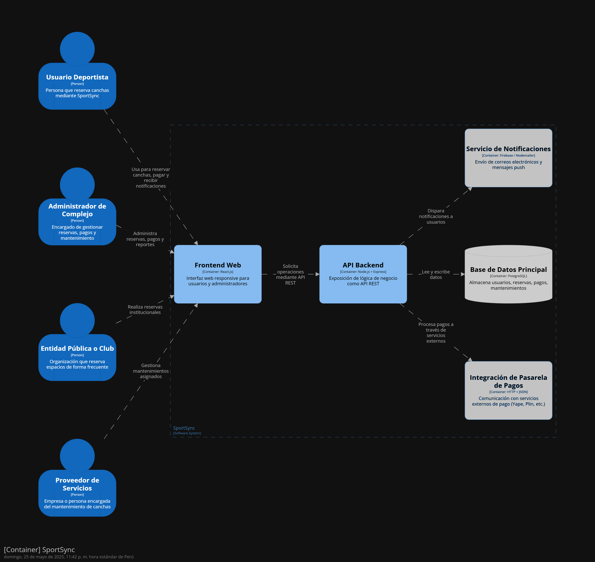

\# 9.4 Iteración 3: Refinar estructuras para abordar el atributo de calidad más importante

---

\## 1. Revisar Entradas

---

\## 2. Objetivo de la Iteración

Fortalecer la \*\*seguridad\*\* de SportSync en puntos críticos:  

\- \*\*Autenticación\*\* robusta con \*\*JWT\*\* (JSON Web Tokens).  

\- \*\*Hashing de contraseñas\*\* antes de almacenar en la base de datos (bcrypt o Argon2).  

\- Protección contra bots con \*\*CAPTCHA\*\* en formularios de registro y login.  

\- Protección de endpoints sensibles con validación de tokens, control de roles y limitación de abusos.

---

\## 3. Elementos del Sistema a Refinar

\- \*\*Módulo de Usuarios\*\* (registro/login seguro)

\- \*\*API Gateway (NGINX)\*\* con validación JWT

\- \*\*Microservicio de Reservas/Biblioteca\*\* (protección de rutas)

\- \*\*Microservicio de Pagos/Suscripciones\*\*

\- \*\*Integración de CAPTCHA\*\*

\- \*\*Hashing y validación de contraseñas\*\*

---

\## 4. Conceptos de Diseño para Satisfacer el Driver

| Código | Decisión de Diseño | Fundamentación |

|--------|---------------------|----------------|

| DEC-43 | Middleware JWT para autenticación | Asegura que solo usuarios autenticados accedan a rutas protegidas. |

| DEC-44 | Control RBAC (Roles Free/Premium) | Restringe funcionalidades premium según rol. |

| DEC-45 | Encriptación AES-256 de datos sensibles | Protege historial, preferencias y pagos. |

| DEC-46 | Sanitización y validación de entradas | Evita inyecciones o datos maliciosos. |

| DEC-47 | Expiración y rotación automática de tokens | Limita exposición prolongada de credenciales. |

| DEC-48 | Rate Limiting adaptativo con Redis | Controla abuso de endpoints críticos. |

| DEC-54 | Hashing de contraseñas en base de datos | Se aplica bcrypt o Argon2 para guardar credenciales de forma segura. |

| DEC-55 | Implementar CAPTCHA en login y registro | Bloquea bots y ataques de fuerza bruta. |

---

\## 5. Elementos de Arquitectura, Responsabilidades e Interfaces

| Código | Elemento | Descripción |

|--------|----------|--------------|

| DEC-49 | Middleware centralizado de JWT en Gateway | Valida tokens y roles antes de reenviar. |

| DEC-50 | Roles RBAC gestionados en microservicio de Usuarios | Upgrade/downgrade de cuenta y control de acceso. |

| DEC-51 | Política de cifrado de campos en BD | Cifrado AES-256 en MongoDB y PostgreSQL. |

| DEC-52 | Redis como limitador de tráfico | Aplica rate limiting dinámico por IP y usuario. |

| DEC-53 | Middleware de sanitización con Joi/Zod | Valida datos entrantes para formularios. |

| DEC-54 | Contraseñas hash almacenadas con bcrypt/Argon2 | Evita almacenamiento plano de claves. |

| DEC-55 | CAPTCHA en endpoints de registro/login | Refuerza validación contra bots automáticos. |

---

\## 6. Vistas y Bosquejo del Diseño

&nbsp;   

\*\*Flujo de seguridad reforzado:\*\*

1\. \*\*Usuario se registra:\*\* CAPTCHA validado → contraseña hasheada → almacenada de forma segura.

2\. \*\*Usuario inicia sesión:\*\* JWT emitido → validado en API Gateway → acceso solo con token válido.

3\. \*\*Acceso a rutas premium:\*\* Gateway revisa rol RBAC → permite o bloquea.

4\. \*\*Rate Limiting Redis:\*\* controla intentos de login, spam de endpoints.

5\. \*\*Datos sensibles:\*\* cifrados en reposo y solo expuestos a usuario autenticado.

---

\## 7. Revisión de Objetivos

---

\## Resumen de la Iteración 3

Esta iteración refuerza \*\*autenticación, autorización y protección de datos\*\*:

\- JWT con validación centralizada en el \*\*API Gateway\*\*.

\- Roles RBAC Free/Premium aplicados por microservicio.

\- Contraseñas \*\*hasheadas\*\* en base de datos (bcrypt/Argon2).

\- \*\*CAPTCHA\*\* activo en registro y login.

\- Cifrado AES-256 para datos confidenciales.

\- Rate Limiting con Redis para prevenir abusos.

\- Sanitización exhaustiva de entradas con Joi/Zod.

---

\## Infraestructura Esperada

\- Auth0 para emisión de JWT y control de roles.

\- API Gateway (NGINX) validando tokens y roles.

\- Redis para rate limiting.

\- Middleware Express para hashing, validación y CAPTCHA.

\- HTTPS activo en toda la comunicación.

\- MongoDB/PostgreSQL con campos cifrados.

---

\## Funcionalidades Implementadas

\- \*\*Inicio de sesión y registro\*\* protegidos con CAPTCHA y hashing.

\- \*\*Roles Free/Premium\*\* aplicados dinámicamente.

\- \*\*Protección de rutas sensibles\*\* con JWT + Gateway.

\- \*\*Rate limiting\*\* contra abuso de endpoints críticos.

\- \*\*Auditoría\*\* para rastreo de operaciones críticas.

Con esto, \*\*SportSync\*\* cuenta con una \*\*base de seguridad fuerte\*\* para soportar pagos, suscripciones y datos personales de forma confiable.

